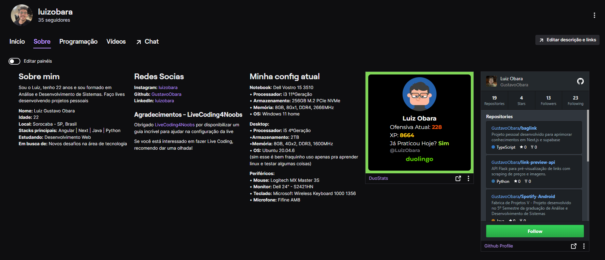

# DuoStats

DuoStats é uma aplicação web que exibe estatísticas de uma conta Duolingo específica. O projeto foi desenvolvido para ser usado como um painel na Twitch, permitindo que streamers mostrem o progresso de aprendizado de idiomas em tempo real aos espectadores.

## Imagem em Teste Local



## 🚀 Funcionalidades

- Exibe o perfil e as estatísticas de uma conta do Duolingo, incluindo:
  - Foto de perfil
  - Nome de usuário
  - Ofensiva atual (dias consecutivos de prática)
  - XP total
  - Status de prática do dia ("Sim" ou "Ainda não")
- Painel responsivo para fácil integração na Twitch
- Alterna as cores do texto e do layout com base no status do usuário

## 📋 Pré-requisitos

- Node.js (versão 14 ou superior)
- NPM ou Yarn para gerenciar pacotes
- Conta no Duolingo para exibir dados (opcional para testes, mas necessário para a integração em produção)

## 🔧 Instalação

1. **Clone o repositório:**

```bash
    git clone https://github.com/gustavoobara/duostats.git
    cd DuoStats
```
2. Instale as dependências:

```bash
    npm install
    # ou
    yarn install
```
3. Inicie o servidor de desenvolvimento:

```bash
    npm run dev
    # ou
    yarn dev
```

4. Acesse a aplicação:
Abra seu navegador e vá para http://localhost:3000 para ver o painel DuoStats.

## 📂 Explicação do Código

A pagina principal, [`DuoStats`](./app/duostats/page.tsx), realiza uma chamada para a API pública do Duolingo, buscando informações do perfil do usuário. Aqui está um resumo de alguns elementos chave do código:

- **Busca de Dados**: A função `fetchData()` faz uma requisição à API do Duolingo para obter as estatísticas do usuário.
- **Exibição de Dados**: Dados como nome, XP e ofensiva são exibidos condicionalmente e formatados com estilos dinâmicos baseados no status atual do usuário.
- **Tratamento de Erros**: Se o usuário não for encontrado ou ocorrer algum erro na busca, uma mensagem de erro é exibida.

## 🌐 API Utilizada

O DuoStats utiliza a API pública do Duolingo não oficial, para buscar informações de usuário, acessível pelo seguinte endpoint:
```bash
    https://www.duolingo.com/2017-06-30/users?username={USERNAME}
```
>**Nota:** Esta API não é documentada oficialmente pelo Duolingo e pode estar sujeita a mudanças.

## 🛠️ Tecnologias Utilizadas

- **React**: Biblioteca para a construção de interfaces de usuário.
- **Next.js**: Framework React para renderização do lado do servidor e geração de sites estáticos.
- **Tailwind CSS**: Framework de CSS para estilização rápida e responsiva.
- **Duolingo API**: API pública não oficial para buscar estatísticas de usuários do Duolingo.

## 🚀 Como Contribuir

1. Faça um fork do projeto.
2. Crie uma nova branch para a sua feature (`git checkout -b feature/nova-feature`).
3. Commit suas alterações (`git commit -m 'Adicionei uma nova feature'`).
4. Faça um push para a branch (`git push origin feature/nova-feature`).
5. Abra um Pull Request.

## 📜 Licença

Este projeto está licenciado sob a MIT License.